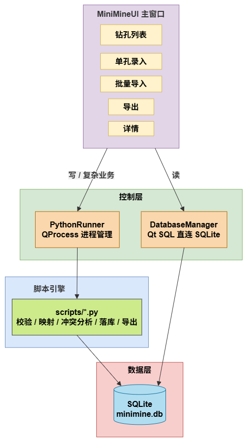

# MiniMine 钻孔数据界面录入模块

本仓库对应课程 **应用开发实习** 小组作业项目 **MiniMine 矿山数字系统** 中的 **钻孔数据界面录入** 功能。基于 **Qt Widgets（C++）桌面界面 + Python 数据处理 + SQLite 持久化**，实现单孔分步录入、多格式批量导入、冲突交互处理、字段映射配置复用，以及 CSV / Excel 导出。

录入结果写入 SQLite，可供系统中其他模块（如三维展示）读取使用。

---

## 项目背景与分工

| 项目 | MiniMine 矿山数字系统 |
|------|----------------------|
| 类型 | 应用开发实习课程 · 小组作业 |
| 本模块职责 | 钻孔数据的界面录入与管理（单孔录入、批量导入、查看、导出） |

---

## 功能概览

| 功能 | 说明 |
|------|------|
| **单孔录入** | 四步向导：钻孔概况 → 测斜 → 地层 → 样品/品位；支持扩展字段与冲突处理 |
| **批量导入** | 支持 `.csv` / `.xlsx` / `.xls`；列名自动建议映射；字段匹配度校验；映射方案保存/加载 |
| **冲突处理** | 主键冲突时逐条或批量选择：跳过 / 覆盖 / 合并 |
| **详情查看** | 主表双击钻孔，分 Tab 查看概况、测斜、地层、样品与品位 |
| **数据导出** | 按表导出为 CSV（UTF-8-BOM）或 Excel（xlsx） |
| **与三维模块衔接** | 数据落库后可供下游三维模块读取（本模块不负责自动联动 QuantyView3D） |

---

## 技术栈

| 层级 | 技术 |
|------|------|
| 界面 | Qt Widgets（C++），`QMainWindow` / `QDialog` / `QTableWidget` |
| 桥接 | `QProcess` 调用 Python，stdout 约定返回 JSON |
| 数据访问（C++） | Qt SQL + SQLite（`DatabaseManager` 单例） |
| 数据处理（Python） | pandas、openpyxl；多编码 CSV 读取 |
| 存储 | SQLite（WAL 模式、`busy_timeout`） |

---

## 架构设计



**分工原则**

- **C++ UI**：交互、表单校验提示、映射配置管理、冲突对话框
- **Python**：批量解析、字段映射落库、冲突分析与合并策略、导出
- **桥接约定**：脚本向 stdout 打印 JSON（`status` / `message` / 业务字段）；失败时带错误信息

**并发注意**：执行 Python 前，`PythonRunner` 会临时关闭 C++ 侧数据库连接，避免 SQLite 写锁冲突，结束后再重新打开。

---

## 目录结构

```
├── app/                      # 程序入口与主窗口
│   ├── main.cpp
│   ├── MiniMineUI.{h,cpp,ui,qrc}
│   └── AppConfig.h           # 路径配置（项目根、DB、Python、scripts）
├── ui/
│   ├── dialogs/
│   │   ├── entry/            # 单孔录入
│   │   ├── import/           # 批量导入、字段映射、冲突对话框
│   │   └── view/             # 钻孔详情、导出
│   └── widgets/              # 通用控件（如数值输入 NumericInputField）
├── bridge/                   # C++ ↔ Python 进程桥
│   └── PythonRunner.{h,cpp}
├── data/sqlite/              # C++ 数据库访问层
│   └── DatabaseManager.{h,cpp}
├── scripts/
│   ├── common/               # DB 工具、文件读取、单孔公共逻辑
│   ├── entry/                # 单孔保存（概况/测斜/地层/样品）
│   ├── import/               # 批量导入、读列名
│   ├── export/               # 表导出
│   ├── schema/               # 建表与结构迁移
│   └── tools/                # 调试查询脚本
├── runtime/                  # 运行时产物（库文件、日志、映射配置等）
├── docs/                     # 文档 / 实习材料
└── README.md
```

---

## 数据模型

核心五表 + 导入溯源表：

| 表名 | 含义 | 主键 |
|------|------|------|
| `DrillHoleInfo` | 钻孔概况 | `borehole_id` |
| `InclineInfo` | 测斜点 | `(borehole_id, point_id)` |
| `StrataInfo` | 地层分层 | `(borehole_id, layer_order)` |
| `SampleRecord` | 样品 | `sample_id` |
| `GradeInfo` | 品位 | `(sample_id, element_name)` |
| `DataSourceInfo` | 导入来源记录 | 自增 id |

**扩展字段**：各核心表含 `EXTRA_DATA`（JSON 文本），用于保存源文件中未映射到标准列的附加列，兼顾标准模型与现场表格差异。

**外键语义**（业务层校验）：测斜 / 地层 / 样品依赖已存在的钻孔；品位依赖已存在的样品。

---

## 核心模块说明

### 1. 单孔录入（`SingleEntryDialog` + `scripts/entry/`）

- 分步录入，可按 Tab 跳转；先保存概况，再写入关联子表
- 数值控件带范围校验与清空按钮（`NumericInputField`）
- 支持自定义扩展字段
- 保存流程：`analyze` 分析冲突 → UI 选择策略 → `save` 落库

### 2. 批量导入（`BatchImportDialog` + `scripts/import/batch_import.py`）

- 统一文件读取（编码自动尝试：utf-8-sig / utf-8 / gbk 等）
- **字段映射**：中英别名打分建议；核心字段匹配度门槛（过低拦截、偏低警告）
- **映射配置**：按目标表保存 / 加载 JSON 方案，可按列结构自动匹配历史配置
- **品位表**：支持多列元素 → 元素名映射（Cu、Zn、Au 等）
- 导入结果统计：新增 / 覆盖 / 合并 / 跳过 / 失败；可下载日志

### 3. 冲突策略（`ImportConflictDialog`）

| 策略 | 行为 |
|------|------|
| **跳过** | 保留库中记录 |
| **覆盖** | 以新数据为主写入 |
| **合并** | 非空新值覆盖旧值；空值保留旧值；`EXTRA_DATA` 做 JSON 合并 |

支持「应用到全部冲突」。

### 4. 详情与导出

- `DrillDetailDialog`：只读多 Tab 详情（样品联动品位与扩展字段展示）
- `ExportDataDialog` + `scripts/export/export_data.py`：按表导出 CSV / XLSX

---

## 设计要点

1. **混合架构**：UI 与重数据处理解耦；Python 脚本可独立调试，C++ 只关心 JSON 契约。
2. **进程桥与资源释放**：`ScopedDatabaseRelease` 保证 Python 写库时 C++ 不占连接。
3. **冲突两阶段提交**：先 analyze 再按用户决议 import，避免盲目覆盖。
4. **字段映射与匹配度**：别名归一化 + 打分建议；核心字段完备性作为导入门禁。
5. **模式弹性**：标准列 + `EXTRA_DATA`，适配现场非标表头。
6. **SQLite 工程实践**：WAL、`busy_timeout`、导入时间戳、结构迁移脚本。

---

## 主流程（简述）

**单孔录入**

```
打开向导 → 填概况并保存 →（可选）测斜 / 地层 / 样品
         → 若主键已存在则弹冲突框 → Python 落库 → 主表刷新
```

**批量导入**

```
选文件 → 选目标表 → 自动建议映射 / 调映射 → 校验匹配度
       → analyze 冲突 → 用户决议 → import → 结果统计与日志
```

---

## 配置说明

本地路径集中在：

- C++：`app/AppConfig.h`（`projectRoot` / `dbPath` / `pythonExe` / `scriptsDir` 等）
- Python：`scripts/common/db_common.py`（`DB_PATH` / `LOGS_DIR`）

换机运行时需对齐上述路径，并保证 Python 环境已安装 `pandas`、`openpyxl`。

---

## 依赖（Python）

```text
pandas
openpyxl
```

（读取旧版 `.xls` 时可能还需额外引擎，视环境而定。）

---

## 说明

本模块为 MiniMine 矿山数字系统课程实习小组作业中的钻孔数据界面录入部分，业务表结构面向地质钻孔数据录入场景设计。
