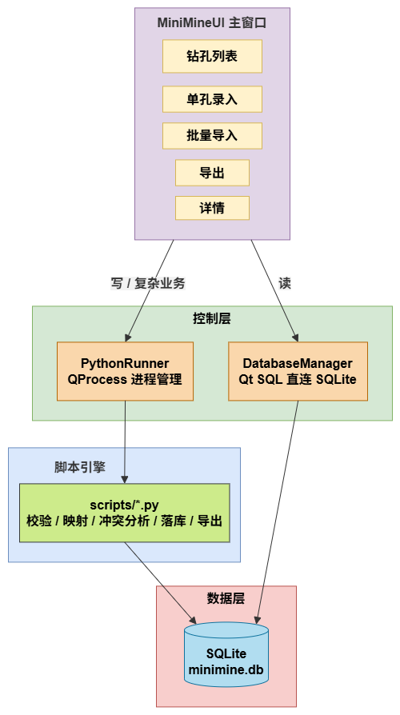

# MiniMine 钻孔数据录入与管理模块

MiniMine 是应用开发实习小组项目中的数字矿山数据管理系统。本仓库为其中的 **钻孔数据录入与管理模块**，由本人负责开发，主要解决地质钻孔数据的单孔录入、批量导入、字段映射、数据校验、冲突处理与导出问题。

项目采用 **Qt Widgets（C++）+ Python + SQLite** 的混合架构：

- Qt/C++ 负责桌面端交互、表单录入、冲突决策和数据展示；
- Python 负责 CSV / Excel 数据解析、字段映射、批量校验与导入；
- SQLite 负责本地持久化；
- C++ 通过 `QProcess` 调用 Python，双方通过 stdout JSON 协议交换执行结果。

---

## 功能概览

| 功能 | 说明 |
|------|------|
| 单孔录入 | 按钻孔概况 → 测斜 → 地层 → 样品 / 品位分步录入 |
| 批量导入 | 支持 `.csv` / `.xlsx` / `.xls` 数据文件 |
| 字段映射 | 根据源表列名建议字段映射，并支持映射方案保存 / 加载 |
| 数据校验 | 校验必填字段、数值范围以及钻孔 / 样品等业务关联关系 |
| 冲突处理 | 主键冲突支持跳过、覆盖、合并三种策略 |
| 扩展字段 | 未映射的非标准字段可保存至 `EXTRA_DATA` JSON |
| 数据查看 | 按钻孔查看概况、测斜、地层、样品和品位数据 |
| 数据导出 | 支持 CSV（UTF-8 BOM）和 XLSX 导出 |
| 错误记录 | 批量导入失败记录可生成错误日志 |

---

## 实际数据验证

使用真实钻孔数据文件进行批量导入验证，共处理 **13,663 条记录**：

| 数据集 | 原始记录 | 成功入库 | 校验拦截 |
|--------|---------:|---------:|---------:|
| 钻孔概况 | 60 | 60 | 0 |
| 数据集 A | 825 | 772 | 53 |
| 数据集 B | 283 | 246 | 37 |
| 数据集 C | 4,091 | 4,091 | 0 |
| 数据集 D | 8,404 | 8,404 | 0 |
| **合计** | **13,663** | **13,573** | **90** |

其中 90 条异常记录由业务校验逻辑拦截，主要用于验证批量导入过程中的异常数据识别与错误记录能力。

> 仓库不包含上述原始数据文件及运行时数据库。

---

## 技术栈

| 层级 | 技术 |
|------|------|
| GUI | C++ / Qt Widgets |
| C++ 数据访问 | Qt SQL / SQLite |
| 进程桥接 | `QProcess` |
| 数据处理 | Python / pandas |
| Excel 处理 | openpyxl / xlrd |
| 数据存储 | SQLite |

---

## 架构



```text
┌──────────────────────────────┐
│        Qt Widgets UI         │
│ 单孔录入 / 批量导入 / 查看 / 导出 │
└──────────────┬───────────────┘
               │
          QProcess + JSON
               │
┌──────────────▼───────────────┐
│        Python Scripts        │
│ 解析 / 映射 / 校验 / 冲突处理 / 导出 │
└──────────────┬───────────────┘
               │
             SQLite
               │
┌──────────────▼───────────────┐
│        MiniMine Database     │
│ 钻孔 / 测斜 / 地层 / 样品 / 品位 │
└──────────────────────────────┘
```

执行 Python 写库操作前，`PythonRunner` 会暂时释放 C++ 侧 SQLite 连接；脚本结束后重新打开数据库连接，降低跨进程同时访问 SQLite 时的锁冲突风险。

---

## 核心设计

### 1. C++ / Python 进程桥

Qt 通过 `QProcess` 调用 Python 脚本：

```text
Qt
 │
 ├── script path
 ├── command arguments
 └── environment
        │
        ▼
     Python
        │
        ▼
 stdout JSON
        │
        ▼
       Qt
```

Python 脚本通过 stdout 返回 JSON，统一表达执行状态、错误信息和业务结果。

项目路径、数据库路径和日志路径通过 `AppConfig` 与环境变量传递，避免依赖开发机器上的绝对路径。

### 2. 批量导入与字段映射

批量导入流程：

```text
选择 CSV / Excel
        ↓
读取源文件列
        ↓
字段映射建议
        ↓
用户确认映射
        ↓
业务数据校验
        ↓
冲突分析
        ↓
跳过 / 覆盖 / 合并
        ↓
事务写入 SQLite
        ↓
导入统计 / 错误日志
```

对于不同来源文件中无法直接映射到标准数据库字段的附加列，统一保存到 `EXTRA_DATA` JSON 中，以适配非标准表头。

### 3. 冲突处理

数据库主键已存在时支持三种处理策略：

| 策略 | 行为 |
|------|------|
| 跳过 | 保留数据库已有记录 |
| 覆盖 | 使用新记录更新已有数据 |
| 合并 | 非空新值覆盖旧值，空值保留旧值，扩展字段进行 JSON 合并 |

批量导入采用“先分析冲突 → 用户选择策略 → 再执行写入”的两阶段流程，避免直接覆盖已有数据。

### 4. 数据一致性校验

业务层维护钻孔数据之间的关联关系：

```text
DrillHoleInfo
 ├── InclineInfo
 ├── StrataInfo
 └── SampleRecord
          │
          └── GradeInfo
```

测斜、地层和样品记录要求对应钻孔已经存在；品位记录要求对应样品已经存在。

同时对业务数据执行合法性检查，包括数值字段格式、测斜深度递增、地层底深与钻孔终孔深度约束等。异常记录不会直接写入数据库，并可记录到导入错误日志中。

### 5. SQLite 访问

SQLite 配置包括：

```text
journal_mode = WAL
busy_timeout = 30000 ms
synchronous = NORMAL
```

C++ 与 Python 两侧均支持在数据库不存在时创建基础 Schema。

`runtime/` 目录用于存放数据库、日志、映射配置和导入文件备份，并通过 `.gitignore` 排除，不将运行时数据提交到仓库。

---

## 数据模型

核心五张业务表及一张导入来源记录表：

| 表 | 含义 | 主键 |
|----|------|------|
| `DrillHoleInfo` | 钻孔概况 | `borehole_id` |
| `InclineInfo` | 测斜记录 | `(borehole_id, point_id)` |
| `StrataInfo` | 地层记录 | `(borehole_id, layer_order)` |
| `SampleRecord` | 样品记录 | `sample_id` |
| `GradeInfo` | 品位记录 | `(sample_id, element_name)` |
| `DataSourceInfo` | 导入来源记录 | 自增 ID |

核心业务表包含 `EXTRA_DATA` 字段，用 JSON 文本保存源文件中的扩展列。

---

## 目录结构

```text
MiniMine/
├── app/                 # 程序入口、主窗口、路径配置
├── bridge/              # C++ ↔ Python 进程桥
├── data/
│   └── sqlite/          # C++ SQLite 数据访问
├── ui/
│   ├── dialogs/
│   │   ├── entry/       # 单孔录入
│   │   ├── import/      # 批量导入 / 字段映射 / 冲突处理
│   │   └── view/        # 数据查看 / 导出
│   └── widgets/
├── scripts/
│   ├── common/          # Python 公共数据库 / 文件工具
│   ├── entry/           # 单孔保存脚本
│   ├── import/          # 批量导入
│   ├── export/          # 数据导出
│   ├── schema/          # Schema 初始化 / 迁移
│   └── tools/           # 调试工具
├── images/              # README 图片
└── README.md
```

`runtime/` 在程序运行过程中按需创建，不属于源码仓库。

---

## 环境依赖

### C++

需要支持 Qt Widgets 与 Qt SQL 的 Qt 开发环境，以及 C++ 编译器。

项目使用的 Qt 模块主要包括：

```text
Qt Widgets
Qt SQL
```

SQLite 通过 Qt SQL 的 QSQLITE 驱动访问。

### Python

建议使用 Python 3，并安装：

```bash
pip install pandas openpyxl xlrd
```

其中：

- `pandas`：批量数据处理；
- `openpyxl`：读取 / 写入 `.xlsx`；
- `xlrd`：读取旧版 `.xls`。

---

## 路径配置

项目不依赖固定的本机绝对路径。

默认情况下，程序会从可执行文件位置向上查找包含 `scripts/` 的项目根目录。

也可以通过环境变量显式指定：

```text
MINIMINE_ROOT
MINIMINE_PYTHON
MINIMINE_DB_PATH
MINIMINE_LOG_DIR
```

例如：

```bash
export MINIMINE_PYTHON=/usr/bin/python3
```

Windows PowerShell：

```powershell
$env:MINIMINE_PYTHON = "C:\Path\To\python.exe"
```

---

## Quick Start

### 1. 获取源码

```bash
git clone https://github.com/youi040804/MiniMine.git
cd MiniMine
```

### 2. 安装 Python 依赖

```bash
pip install pandas openpyxl xlrd
```

### 3. 可选：验证数据库初始化

无需启动 GUI，也可以通过 Python 脚本初始化并检查数据库：

```bash
python scripts/schema/import_data.py
python scripts/tools/query.py
```

首次运行时会在：

```text
runtime/minimine.db
```

创建 SQLite 数据库及基础表结构。

### 4. 运行 Qt 程序

Qt GUI 需要在具备 Qt Widgets、Qt SQL 和 QSQLITE 驱动的 Qt 开发环境中构建运行。

程序启动后会使用 `runtime/minimine.db`；如果数据库不存在，数据库访问层会创建基础表结构。

---

## Python 数据库 Smoke Test

数据库初始化逻辑可以脱离 GUI 验证。

例如在 Linux / WSL 中：

```bash
rm -rf /tmp/minimine-smoke

MINIMINE_DB_PATH=/tmp/minimine-smoke/minimine.db \
python3 scripts/tools/query.py
```

在数据库文件和父目录均不存在的情况下，脚本会创建数据库 Schema，并输出各核心表当前记录数。

空库预期结果：

```text
DrillHoleInfo: 0 条
InclineInfo: 0 条
StrataInfo: 0 条
SampleRecord: 0 条
GradeInfo: 0 条
```

---

## 项目说明

本仓库对应 MiniMine 数字矿山系统中的钻孔数据录入与管理模块。

项目重点在于桌面端数据录入、非标准表格批量导入、字段映射、业务数据校验以及 C++ / Python / SQLite 之间的工程协作，不包含完整数字矿山系统中的三维建模等其他模块。